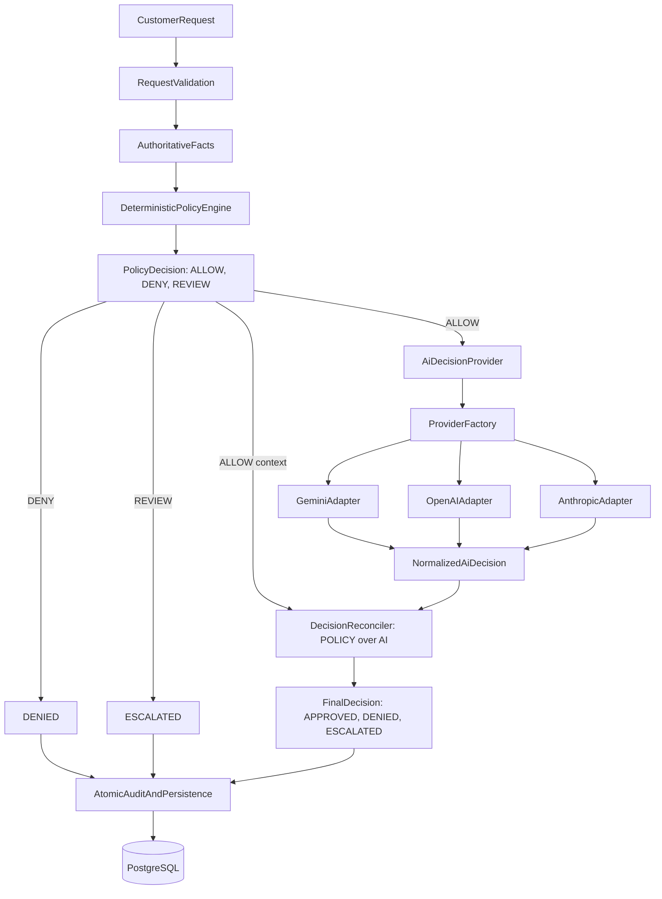

# AI-Powered Refund Support Plan

## Architecture and project setup
- Create a small monorepo with [`backend/`](backend/), [`frontend/`](frontend/), [`policy/refund-policy.md`](policy/refund-policy.md), root [`.env.example`](.env.example), and [`docker-compose.yml`](docker-compose.yml).
- Use NestJS modules with global validation, versioned REST routes, Swagger documentation, structured logging, health checks, and CORS restricted through environment configuration.
- Use Vite + React + TypeScript, React Router, TanStack Query, Tailwind CSS, and locally owned shadcn/ui components. Serve the production build through Nginx.
- Containerize PostgreSQL, API, and frontend with health checks and dependency readiness so `docker compose up --build` is sufficient.



## Data and policy layer
- Define Prisma models in [`backend/prisma/schema.prisma`](backend/prisma/schema.prisma) for customers, orders, order items, immutable customer refund requests, versioned processing attempts, final decisions, and append-only audit events. Keep lifecycle and outcome distinct: `ProcessingAttempt.status` is `PENDING | PROCESSING | COMPLETED | FAILED`, while `FinalDecision.status` is `APPROVED | DENIED | ESCALATED`; for example, an AI timeout produces a failed attempt and an escalated final decision.
- Make PostgreSQL the final concurrency authority with database-enforced uniqueness for scoped idempotency keys, exactly one terminal `FinalDecision` per refund request, and at most one active processing attempt per request. Catch Prisma unique/transaction/serialization conflicts and map them to deterministic idempotent responses or documented API conflicts.
- Represent every monetary value as integer minor units with no floating-point arithmetic: `4999` means `$49.99` and `50000` means `$500.00`.
- Add idempotent seed data in [`backend/prisma/seed.ts`](backend/prisma/seed.ts): approximately 15 customers with varied order histories covering eligible, final-sale, expired-window, over-$500, damaged, incorrect-item, duplicate, and suspicious scenarios.
- Write the human-readable policy in [`policy/refund-policy.md`](policy/refund-policy.md) and implement matching named, typed rules in [`backend/src/refunds/policy/`](backend/src/refunds/policy/) that produce only `ALLOW`, `DENY`, or `REVIEW`: 30-day window, final-sale denial, damaged/incorrect-item eligibility, duplicate/conflicting-request review, and missing-data review.
- Define the high-value rule once and reuse it in documentation and code: amounts strictly greater than `50000` minor units require `REVIEW`; exactly `$500.00` does not trigger this rule.
- Persist rule identifiers, normalized facts, decision transitions, AI metadata, and errors as audit records without storing hidden chain-of-thought.

## Backend workflow and APIs
- Implement DTO-validated endpoints under `/api/v1`: submit a refund request, list a seeded customer’s orders, list/filter/paginate refund requests, view request details/audit history, and report health; expose OpenAPI under `/docs`.
- Orchestrate submissions in [`backend/src/refunds/refunds.service.ts`](backend/src/refunds/refunds.service.ts): validate input, resolve authoritative order facts, create/find the idempotent request, claim a processing attempt, evaluate deterministic policy, call AI outside any database transaction, reconcile, then atomically persist the decision and audit events with optimistic/concurrency checks.
- Enforce a fixed decision flow: policy `DENY` immediately becomes `DENIED`; policy `REVIEW` immediately becomes terminally `ESCALATED` without an AI call; only policy `ALLOW` invokes AI, and only a validated AI `APPROVE` that passes reconciliation can become `APPROVED`. Every other AI recommendation or state—including `DENY`, an unexpected value, uncertainty, invalid output, timeout, or error—becomes `ESCALATED`.
- Require a client-supplied `Idempotency-Key`; store it under a unique scope with a canonical payload hash. The same key and payload returns the original response, while the same key with a different payload returns `409 Conflict`.
- Use database uniqueness/concurrency guards so simultaneous submissions cannot create multiple active attempts or refund the same order twice; retries operate on decision attempts without mutating the original customer request.
- Define retry eligibility narrowly: a request is retryable only when its latest processing attempt failed before any terminal final decision was persisted. `APPROVED`, `DENIED`, and persisted `ESCALATED` decisions are terminal and are not automatically reprocessed.
- Keep financial execution out of scope: the demo produces an authoritative support decision but never issues a real refund or calls a payment provider.

## Provider-agnostic AI integration and safeguards
- Define an `AiDecisionProvider` interface and provider factory in [`backend/src/ai/`](backend/src/ai/). Keep refund-domain and orchestration code independent of provider SDKs so `RefundService` only depends on the interface.
- Prevent provider adapters from writing refund requests, attempts, decisions, or audit records. `DecisionReconciler` is the only component permitted to produce an authoritative final status; persistence services may store but not reinterpret it.
- Implement Gemini, OpenAI, and Anthropic adapters behind the interface. Select one with `AI_PROVIDER=gemini|openai|anthropic`, defaulting to Gemini for initial free-tier development; require credentials only for the selected provider.
- Keep provider-specific prompting, structured-output, and schema handling inside each adapter, then normalize responses into one internal `AiDecision` type before reconciliation.
- Send only bounded inputs required for the assessment: authoritative order facts, normalized refund reason, length-limited customer message, and applicable policy rule IDs; exclude unrestricted records and unrelated customer history.
- Treat all provider output as untrusted. Validate recommendation enums, confidence range, policy-reference IDs, maximum field lengths, and unsupported factual claims inside the adapter, then validate the normalized result again against deterministic facts during reconciliation.
- Require the reconciler—not only the provider adapter—to verify every AI policy reference against the policy-rule registry and every factual claim against the authoritative fact set. Any mismatch produces `ESCALATED`.
- Defend against injection by keeping policy/system instructions separate from untrusted text, limiting and sanitizing request content, passing database-derived facts, disabling model-side mutations/tools, and recording detection signals for support review.
- Persist AI observability metadata: provider, model, provider request/attempt ID when available, latency, outcome, timeout/validation failure, token usage when available, normalized recommendation, and confidence. Do not persist raw prompts or raw responses by default.
- Keep secrets server-side and define `AI_PROVIDER=gemini` plus `GEMINI_API_KEY`/`GEMINI_MODEL`, `OPENAI_API_KEY`/`OPENAI_MODEL`, `ANTHROPIC_API_KEY`/`ANTHROPIC_MODEL`, and `AI_TIMEOUT_MS` in [`.env.example`](.env.example); only the selected provider’s credentials are required.
- Reject an unknown `AI_PROVIDER` at startup. For a recognized provider with missing credentials or runtime availability failures, keep the application usable in a degraded state and escalate affected requests.
- Ensure no provider output can override deterministic policy; the reconciler remains the sole producer of the authoritative Approved, Denied, or Escalated result.

## Public response contract
- Return a stable, customer-safe response containing only `requestId`, final `status`, `customerMessage`, and an optional concise public `reason`. Never expose prompts, raw provider responses/errors, hidden reasoning, internal policy implementation details, or operational metadata through the customer endpoint.

```json
{
  "requestId": "rr_123",
  "status": "APPROVED",
  "customerMessage": "Your refund request has been approved.",
  "reason": "The order meets the refund policy requirements."
}
```

```json
{
  "requestId": "rr_124",
  "status": "ESCALATED",
  "customerMessage": "Your request needs to be reviewed by our support team."
}
```

## Frontend product experience
- Build a customer route in [`frontend/src/pages/CustomerRequestPage.tsx`](frontend/src/pages/CustomerRequestPage.tsx) with customer/order selection, order summary, refund reason/message form, submission states, accessible validation, and a clear Approved/Denied/Escalated result card.
- Build an admin route in [`frontend/src/pages/AdminDashboardPage.tsx`](frontend/src/pages/AdminDashboardPage.tsx) with searchable/filterable recent requests, status badges, key metrics, and a detail sheet showing policy hits, concise reasoning, AI/provider metadata, and chronological audit notes.
- Create a typed API client and query hooks; include useful loading, empty, failure, and retry states and responsive keyboard-accessible layouts using shadcn/ui primitives.
- Clearly label the admin view as demo-only and document authentication as an intentional production follow-up rather than implying it is secured.

## Verification and delivery
- Use Jest for NestJS unit tests and Supertest for API tests. Cover every named policy rule and boundary—including `$500.00` versus `>$500.00`—fact normalization, prompt-injection signals, reconciliation branches, retry eligibility, canonical payload hashing, public-response mapping, audit construction, provider selection, configuration validation, and provider failure fallback. Prove that changing AI output cannot bypass any deterministic rule.
- Supply a fake `AiDecisionProvider` for credential-free orchestration/API tests. Add adapter contract tests shared by Gemini, OpenAI, and Anthropic implementations, mocking provider HTTP/SDK boundaries to verify request shaping, bounded data, valid normalization, malformed JSON/schema failures, unknown references, unsupported claims, timeouts, rate limits, and redaction; keep optional credentialed smoke tests separate and excluded from default CI.
- Run database integration tests against isolated PostgreSQL rather than mocking Prisma. Apply migrations and fixtures per suite, then verify constraints, transactions, processing-state transitions, immutable requests, terminal-decision protection, idempotency-key conflicts, rollback behavior, and simultaneous-submission races.
- Add full Nest API e2e tests for DTO validation, status codes, headers, customer-safe response contracts, admin pagination/filtering/detail views, health/degraded-provider behavior, Swagger availability, and every seeded scenario.
- Use Vitest, React Testing Library, and Mock Service Worker for frontend unit/integration tests covering customer validation/submission, loading/error/result states, safe retry behavior, status badges, admin search/filter/pagination, audit details, accessibility, and assurance that internal AI data is never rendered to customers.
- Add a small Playwright browser smoke suite for the containerized happy path and admin inspection path; verify the built Nginx frontend communicates with the Nest API.
- Define coverage thresholds for critical domain modules while prioritizing branch coverage of policy, reconciliation, idempotency, and concurrency behavior over a misleading repository-wide 100% target.
- Run linting, formatting checks, TypeScript type checks, unit/integration/e2e suites, Prisma migration validation, and production builds through documented scripts and CI-friendly commands.
- Verify Docker startup, migrations/seeding, health checks, every documented seeded scenario, Swagger, and behavior with valid credentials, missing credentials, provider timeout, and provider failure.
- Expand [`README.md`](README.md) with setup/environment instructions, architecture and decision flow, AI boundaries, policy assumptions, demo accounts/scenarios, API documentation, testing commands, security/privacy tradeoffs, limitations, and screenshots where useful.

## Acceptance criteria
- `docker compose up --build` starts the complete demo, and a fresh database migrates and seeds without manual SQL.
- All default unit, integration, API e2e, frontend, and browser smoke tests run without paid-provider credentials and pass from documented commands.
- Every seeded scenario produces its documented deterministic `ALLOW`, `DENY`, or `REVIEW` result and corresponding final outcome.
- Automated tests prove the complete decision matrix: `DENY` skips AI and becomes `DENIED`; `REVIEW` skips AI and becomes `ESCALATED`; `ALLOW + valid APPROVE` becomes `APPROVED`; and `ALLOW` with `DENY`, invalid output, timeout, provider error, unknown policy reference, or unsupported fact becomes `ESCALATED`.
- Policy `DENY` produces `DENIED`, policy `REVIEW` produces terminal `ESCALATED` without an AI call, and only policy `ALLOW` may invoke AI.
- Prompt-injection text cannot alter authoritative facts or deterministic policy results.
- Repeating the same `Idempotency-Key` and payload returns the original result; a changed payload returns `409`; concurrent submissions cannot refund one order twice.
- A terminally completed refund request cannot be reprocessed into a different final outcome. Only a request whose latest attempt failed before persistence of a final decision may create or claim a retry attempt, and concurrency guards prevent conflicting terminal decisions.
- Persisted `ESCALATED` is terminal for the customer workflow and cannot be silently retried into `APPROVED`; escalation follow-up would require a separate, explicitly modeled human-review workflow outside this demo.
- Every final decision has an auditable trail, while hidden chain-of-thought and raw prompts/responses are neither stored nor exposed.
- Provider credentials never reach the frontend, and changing `AI_PROVIDER` requires no refund-domain code changes.
- The application remains usable and safely escalates requests when the configured provider is unavailable.
- The admin dashboard clearly labels authentication as out of scope for this assessment/demo.
- No endpoint or background process issues a real financial refund; payment-provider integration is explicitly out of scope.